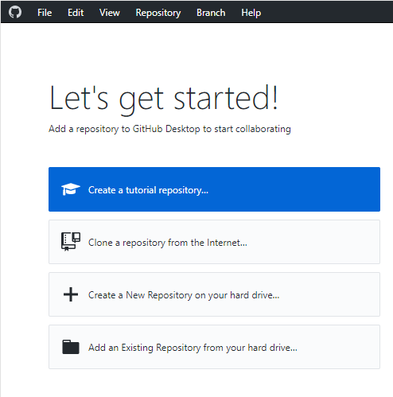
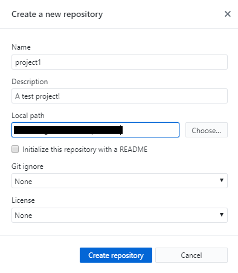
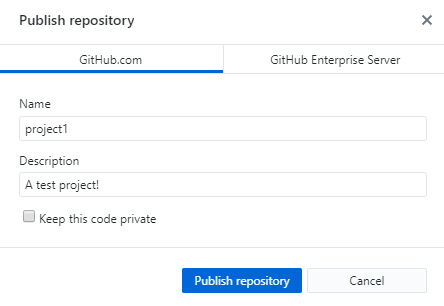
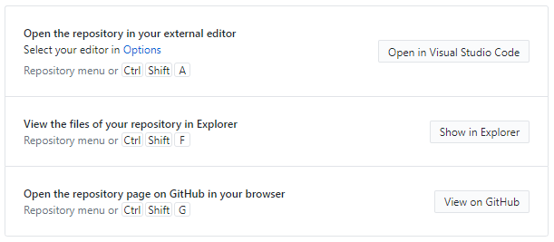
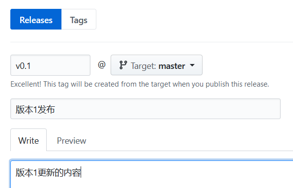

# github-update
Use GitHub to auto-update your game.

使用GitHub来发布你的游戏并自动更新！

## 脚本功能
脚本提供了2个方法，请自行添加到游戏的特定位置：
```ruby
GitHub_Update.version # 返回 [@old_tag, @new_tag]
GitHub_Update.update # 退出游戏，更新后重新打开游戏
```
注：
1. 在update前要先调用version获取版本
2. 如果`@old_tag == @new_tag`，则update会跳过

## 范例
[范例地址](https://github.com/gxm11/project1/releases)，请下载v0.2版本，跟NPC对话后就会升级到v0.3版本。

## 使用方法（GitHub老司机）
1. 复制整个Update文件夹，并把update.rb加入脚本编辑器
2. 修改脚本里面的内容：
```ruby
module GitHub_Update
  Owner = "你的github账号"
  Repo = "你的仓库名"
  Version = "当前的版本"
end
```
3. 制作一个发行版，**tag的名字要跟第2步里设置的一致**

## 使用Github客户端来发布
接下来用Github客户端来演示，下载地址：https://desktop.github.com/
1. 下载客户端并注册一个账号，登录客户端后可以看到如下界面：



2. 选择第 3 项，创建新的仓库，比如这里名字就是project1



3. 创建空的仓库后，选择**Show in Explorer**进入文件夹，把打包好的游戏放进去。
- 附上Update文件夹
- Github会忽略空文件夹，在空文件夹里创建一个空的记事本文件就行


4. 举个例子，新建一个空的RMXP工程，附上Update/文件夹后，写上提交信息后点击**commit to master**：


5. 把项目同布到GitHub上，选择Publish repository
- 如果你已经发布了这个键会变成Push origin，点一下就行：


6. 注意去掉 keep private，并且这个Name就是**你的仓库名**，不要使用奇怪的名字，就字母数字这些



7. 现在可以去Github上查看自己的工程了！点击**View on Github**



8. 网页里可以看到自己的工程了。提一下这里没有Audio和Graphics文件夹是因为这两个文件夹是空的，被Github忽略了。


9. 点击横栏上的**release**，进入发布页面，选择**Create a new release**


10. 注意这里的tag name（图中是v0.1）要和脚本中的Version完全一致！当你下一次更新的时候，就要换另一个版本号。版本号最好是`v`开头



11. 点击**Publish Release**，回到Release页面。下载这个`Source code (zip)`文件，并把它传给你的朋友。


12. 当你下一次更新游戏的时候，把准备发布的内容放到文件夹里，然后执行上面的4，5，9，10，11步即可。不要忘了修改脚本里的内容：
```ruby
module GitHub_Update
  Owner = "你的github账号"
  Repo = "你的仓库名"
  Version = "当前的版本"
end
```
13. 如果玩家使用的是旧版本，在执行GitHub_Update.update后，就会退出游戏并更新到最新Release的版本。